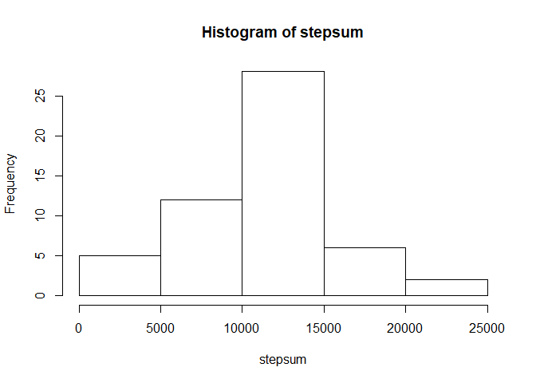
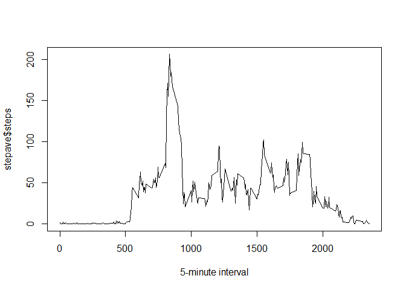
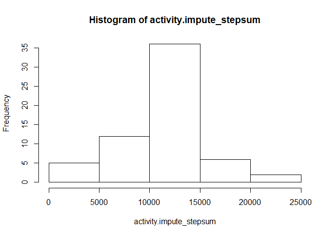
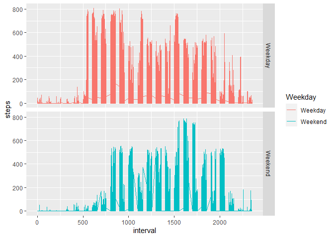

## Loading and preprocessing the data

```r
library(dplyr)
```

```
## Warning: package 'dplyr' was built under R version 3.6.3
```

```
## 
## Attaching package: 'dplyr'
```

```
## The following objects are masked from 'package:stats':
## 
##     filter, lag
```

```
## The following objects are masked from 'package:base':
## 
##     intersect, setdiff, setequal, union
```

```r
setwd("C:/Users/94979/Desktop")
activity <- read.csv("activity.csv", header = TRUE, sep = ",", na.strings = "NA")
activity$date <- as.Date(activity$date, "%Y-%m-%d")
```


## What is mean total number of steps taken per day?

```r
stepsum<-tapply(activity$steps,activity$date,sum)
hist(stepsum)
```

<!-- -->

```r
mean(stepsum,na.rm = TRUE)
```

```
## [1] 10766.19
```

```r
median(stepsum,na.rm = TRUE)
```

```
## [1] 10765
```


## What is the average daily activity pattern?

```r
stepave<-aggregate(steps~interval,data = activity,FUN = mean,na.rm=TRUE)
plot(stepave$interval,stepave$steps,xlab = "5-minute interval",type = "l")
```

<!-- -->

```r
stepave$interval[which.max(stepave$steps)]
```

```
## [1] 835
```


## Imputing missing values

```r
activity.comp <- activity[complete.cases(activity),]
missing.rows <- nrow(activity) - nrow(activity.comp)
activity.impute <- activity
activity.impute$steps[is.na(activity.impute$steps)] <- stepave$steps[match(activity.impute$interval, stepave$interval)]
```

```
## Warning in activity.impute$steps[is.na(activity.impute$steps)] <-
## stepave$steps[match(activity.impute$interval, : 被替换的项目不是替换值长度的倍数
```

```r
activity.impute_stepsum<-tapply(activity.impute$steps,activity.impute$date,sum)
hist(activity.impute_stepsum)
```

<!-- -->

```r
mean(activity.impute_stepsum,na.rm = TRUE)
```

```
## [1] 10766.19
```

```r
median(activity.impute_stepsum,na.rm = TRUE)
```

```
## [1] 10766.19
```


## Are there differences in activity patterns between weekdays and weekends?

```r
weekdays <- activity.impute %>%
  mutate(Weekday = weekdays(date)) %>%
  mutate(Weekday = factor(Weekday, levels = unique(Weekday),
                          labels = c("Weekday", "Weekday", "Weekday", "Weekday", "Weekday", "Weekend", "Weekend")))
library(ggplot2)
```

```
## Warning: package 'ggplot2' was built under R version 3.6.3
```

```r
p<-ggplot(weekdays,aes(x=interval,y=steps,colour=Weekday))+geom_line()+facet_grid(weekdays$Weekday ~. )
p
```

<!-- -->

